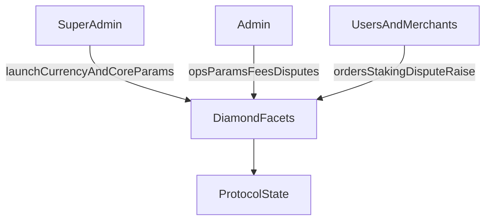

The protocol defines three governance scopes.

## Super Admin

Launches currencies, sets core risk/limit parameters, and manages critical protocol configuration.

## Admin

Manages operational parameters including spread, merchant fee percentages, disputes, and merchant/payment-channel actions.

## Merchant and User

Scope covers order lifecycle, staking/registration flows, and dispute initiation according to contract rules.

## Access Control Flow

