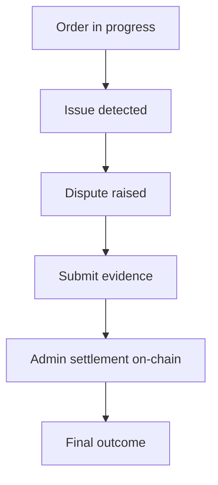

If a dispute is raised, follow these steps.

## Dispute Resolution Process

<Steps>
  <Step title="Review order context">
    Review order context and timestamps to understand the issue.
  </Step>
  <Step title="Submit evidence">
    Submit supporting evidence in-app. Include all relevant documentation.
  </Step>
  <Step title="Follow settlement updates">
    Follow settlement updates and resulting order state transitions.
  </Step>
</Steps>

## On-Chain Settlement

Disputes are settled on-chain by authorized admins under protocol fault rules and dispute windows.

<Warning>
Always submit evidence promptly when a dispute is raised. The quality and timeliness of your evidence can significantly impact the dispute outcome.
</Warning>

<Note>
Jury-based escalation tiers and governance-vote finality for disputes are planned for a future release.
</Note>
