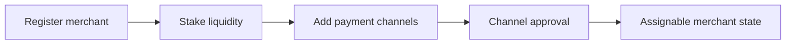

Follow these steps to set up your merchant account and begin accepting orders.

## Step 1: Register and Stake

<Steps>
  <Step title="Register as merchant">
    Register as merchant for an active currency.
  </Step>
  <Step title="Stake required liquidity">
    Stake required settlement liquidity.
  </Step>
  <Step title="Confirm profile">
    Confirm your merchant profile and operational status.
  </Step>
</Steps>

## Step 2: Add Payment Channels

<Steps>
  <Step title="Add payment channels">
    Add payment channels for your supported rails.
  </Step>
  <Step title="Wait for approval">
    Wait for required approval states.
  </Step>
  <Step title="Keep channels active">
    Keep approved channels active and up to date.
  </Step>
</Steps>

## Setup Flow Diagram

<Note>
Ensure all steps are completed before expecting order assignments. Your merchant status must show as active and channels must be approved.
</Note>
