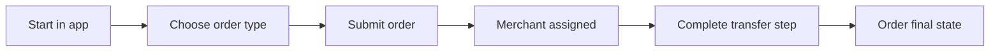

## Placing an Order

Follow these steps to place any type of order on P2P Protocol:

<Steps>
  <Step title="Select order type">
    Open the app and select `BUY`, `SELL`, or `PAY` depending on what you want to do.
  </Step>
  
  <Step title="Enter details">
    Enter the amount and provide any required recipient or payment details for your order.
  </Step>
  
  <Step title="Submit order">
    Submit your order and wait for merchant assignment. The protocol will match you with an eligible merchant.
  </Step>
  
  <Step title="Follow prompts">
    Follow the app prompts to complete the transfer and confirmation steps specific to your order type.
  </Step>
</Steps>

## Order Flow Diagram

Here's a visual representation of the order placement process:

<Info>
  Your order status will update automatically as it progresses through each stage. You can track it in real-time through the app.
</Info>

<Warning>
  Make sure to complete all required steps promptly to avoid order expiration or cancellation.
</Warning>