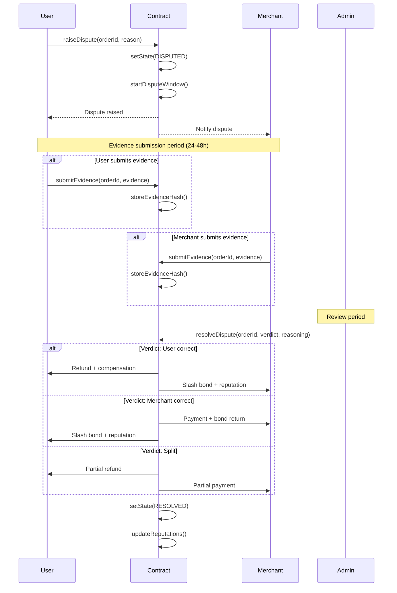

This section provides detailed technical specifications and reference materials for developers, researchers, and advanced users.

## Appendix A: State Machines & Sequence Diagrams

Detailed state machines and sequence diagrams for on-/off-ramp and dispute flows.

### A.1 On-Ramp State Machine

<Accordion title="Complete On-Ramp State Machine">
**States:**
```
INITIAL
  ↓
  [User creates order]
  ↓
OPEN
  ├─> [T_match timeout] ─> EXPIRED
  └─> [Merchant accepts] ─> MATCHED
      ├─> [T_fiat timeout] ─> EXPIRED
      └─> [User transfers fiat] ─> FUNDED
          ├─> [T_confirm timeout] ─> DISPUTED
          └─> [Merchant confirms] ─> CONFIRMED
              ├─> [User disputes] ─> DISPUTED
              │   └─> [Admin resolves] ─> RESOLVED
              └─> [T_dispute passes] ─> SETTLED
```

**Transitions:**

| From | To | Trigger | Timeout | Effects |
|------|-----|---------|---------|----------|
| INITIAL | OPEN | createOrder() | - | Lock user bond |
| OPEN | MATCHED | acceptMatch() | T_match | Assign merchant, lock merchant bond |
| OPEN | EXPIRED | - | T_match | Return bonds |
| MATCHED | FUNDED | confirmFiat() | T_fiat | Record fiat transfer |
| MATCHED | EXPIRED | - | T_fiat | Return bonds |
| FUNDED | CONFIRMED | merchantConfirm() | T_confirm | Prepare USDC release |
| FUNDED | DISPUTED | - | T_confirm | Enter dispute process |
| CONFIRMED | SETTLED | - | T_dispute | Release USDC, return bonds, update reputation |
| CONFIRMED | DISPUTED | raiseDispute() | T_dispute | Freeze settlement |
| DISPUTED | RESOLVED | adminResolve() | - | Execute verdict, slash or return bonds |
</Accordion>

### A.2 Off-Ramp State Machine

<Accordion title="Complete Off-Ramp State Machine">
**States:**
```
INITIAL
  ↓
  [User creates sell order + locks USDC]
  ↓
OPEN
  ├─> [T_match timeout] ─> EXPIRED (USDC returned)
  └─> [Merchant accepts + posts bond] ─> MATCHED
      ├─> [T_fiat timeout] ─> DISPUTED
      └─> [Merchant sends fiat] ─> FUNDED
          ├─> [Merchant confirms + provides proof] ─> CONFIRMED
          └─> [User disputes non-receipt] ─> DISPUTED
              ├─> [T_dispute passes, no dispute] ─> SETTLED
              └─> [Admin resolves dispute] ─> RESOLVED
```

**Key Differences from On-Ramp:**
- USDC locked at order creation
- Merchant posts bond at match acceptance
- Merchant must provide payment proof
- User can dispute non-receipt
- Default settlement if no dispute within T_dispute
</Accordion>

### A.3 Dispute Resolution Sequence

<Accordion title="Dispute Resolution Sequence Diagram">

</Accordion>

## Appendix B: Proof Interface Specs

Inputs/outputs for identity predicates; verifier APIs; planned evidence module interface.

### B.1 ZK-KYC Proof Interface

<Accordion title="Identity Proof Specification">
**Proof Type: Government ID Verification**

**Private Inputs:**
```typescript
interface GovernmentIDPrivateInputs {
  documentType: 'passport' | 'nationalID' | 'driversLicense';
  documentNumber: string;
  fullName: string;
  dateOfBirth: Date;
  nationality: string;
  issuingAuthority: string;
  documentSignature: bytes;
}
```

**Public Inputs:**
```typescript
interface GovernmentIDPublicInputs {
  requiredAge: number;           // e.g., 18
  allowedNationalities: string[];  // e.g., ['*'] or ['US', 'EU']
  sanctionsList: string[];        // OFAC, UN, EU lists
  verifierAddress: address;
  timestamp: number;
}
```

**Proof Output:**
```typescript
interface GovernmentIDProof {
  proofType: 'zkSNARK';
  proofData: bytes;               // ZK proof
  publicSignals: {
    isOver18: boolean;
    isNotSanctioned: boolean;
    nationalityAllowed: boolean;
    documentValid: boolean;
  };
  commitmentHash: bytes32;        // On-chain commitment
  expiresAt: number;              // Proof validity period
}
```

**Verification:**
```solidity
function verifyGovernmentID(
    GovernmentIDProof calldata proof
) external view returns (bool) {
    require(proof.expiresAt > block.timestamp, "Proof expired");
    
    // Verify zk-SNARK
    bool proofValid = zkVerifier.verify(
        proof.proofData,
        proof.publicSignals
    );
    
    require(proofValid, "Invalid proof");
    
    // Check all predicates passed
    require(
        proof.publicSignals.isOver18 &&
        proof.publicSignals.isNotSanctioned &&
        proof.publicSignals.nationalityAllowed &&
        proof.publicSignals.documentValid,
        "KYC requirements not met"
    );
    
    return true;
}
```
</Accordion>

### B.2 Social Account Verification (Reclaim Protocol)

<Accordion title="Social Proof Specification">
**Proof Type: Social Account Verification via Reclaim Protocol**

**Supported Platforms:**
- GitHub (developer reputation)
- LinkedIn (professional verification)
- Twitter (social presence)
- Others as added by Reclaim

**Private Inputs:**
- OAuth tokens or session cookies (never exposed)
- Account credentials (never exposed)
- Full profile data (selectively revealed)

**Public Inputs:**
```typescript
interface SocialProofPublicInputs {
  platform: 'github' | 'linkedin' | 'twitter' | string;
  minimumAccountAge: number;      // Days
  minimumFollowers?: number;      // Platform-specific
  verifiedAccount: boolean;       // Platform verification status
  reclaimAppId: string;
}
```

**Proof Output:**
```typescript
interface ReclaimSocialProof {
  proofType: 'zkTLS';
  reclaimProof: bytes;            // Reclaim-generated proof
  publicSignals: {
    accountAgeValid: boolean;
    meetsThresholds: boolean;
    accountVerified: boolean;
    accountActive: boolean;
  };
  commitmentHash: bytes32;
  expiresAt: number;
}
```

**Integration:**
```typescript
// User-side: Generate proof
const proof = await reclaimProtocol.generateProof({
  platform: 'github',
  requirements: {
    minimumAccountAge: 365,  // 1 year
    minimumFollowers: 50
  }
});

// Submit to P2P Protocol
await p2pProtocol.submitSocialProof(proof);
```
</Accordion>

### B.3 Bank Transaction Proof (Planned)

<Accordion title="Bank Transaction Evidence Specification (Roadmap)">
**Proof Type: Payment Confirmation**

**Private Inputs:**
```typescript
interface BankTransactionPrivateInputs {
  bankName: string;
  accountNumber: string;
  transactionId: string;
  amount: number;
  currency: string;
  timestamp: Date;
  recipientAccount: string;
  senderAccount: string;
  tlsSessionProof: bytes;         // zkTLS proof
}
```

**Public Inputs:**
```typescript
interface BankTransactionPublicInputs {
  expectedAmount: number;
  expectedCurrency: string;
  timeWindowStart: number;
  timeWindowEnd: number;
  recipientCommitment: bytes32;   // Hash of recipient
  orderId: bytes32;
}
```

**Proof Output:**
```typescript
interface BankTransactionProof {
  proofType: 'zkTLS';
  proofData: bytes;
  publicSignals: {
    amountMatches: boolean;
    currencyMatches: boolean;
    withinTimeWindow: boolean;
    recipientMatches: boolean;
  };
  commitmentHash: bytes32;
  expiresAt: number;
}
```

**Verification Flow:**
1. Merchant claims fiat payment sent/received
2. Merchant generates zkTLS proof from banking portal
3. Proof submitted to on-chain verifier or off-chain relayer
4. Verifier checks proof cryptographically
5. Attestation hash posted on-chain
6. Order settlement proceeds automatically

**Privacy Properties:**
- Bank name not revealed
- Account numbers not revealed
- Other transactions not revealed
- Only proof of specific transaction posted
</Accordion>

## Appendix C: Oracle Adapter Spec

Sources, aggregation, parameters.

### C.1 Oracle Architecture

<Accordion title="Oracle System Design">
**Components:**

```typescript
interface OracleAdapter {
  // Data sources
  sources: PriceSource[];
  
  // Aggregation method
  aggregator: MedianAggregator | TWAPAggregator;
  
  // Circuit breakers
  circuitBreaker: CircuitBreaker;
  
  // Methods
  getPrice(pair: string): Promise<Price>;
  addSource(source: PriceSource): void;
  removeSource(sourceId: string): void;
}

interface PriceSource {
  id: string;
  name: string;
  type: 'CEX' | 'DEX' | 'P2P' | 'ORACLE';
  weight: number;
  endpoint: string;
  fetchPrice(pair: string): Promise<PriceData>;
}

interface PriceData {
  price: number;
  timestamp: number;
  source: string;
  volume?: number;
}
```

**Current Sources (Example for USDC/USD):**
```json
[
  {
    "id": "binance",
    "name": "Binance",
    "type": "CEX",
    "weight": 1.5,
    "endpoint": "https://api.binance.com/api/v3/ticker/price"
  },
  {
    "id": "coinbase",
    "name": "Coinbase",
    "type": "CEX",
    "weight": 1.5,
    "endpoint": "https://api.coinbase.com/v2/prices/USDC-USD/spot"
  },
  {
    "id": "kraken",
    "name": "Kraken",
    "type": "CEX",
    "weight": 1.0,
    "endpoint": "https://api.kraken.com/0/public/Ticker"
  },
  {
    "id": "uniswap_v3",
    "name": "Uniswap V3",
    "type": "DEX",
    "weight": 1.0,
    "endpoint": "on-chain"
  },
  {
    "id": "chainlink",
    "name": "Chainlink",
    "type": "ORACLE",
    "weight": 2.0,
    "endpoint": "on-chain"
  }
]
```
</Accordion>

### C.2 Price Aggregation Algorithm

<Accordion title="Median + TWAP Calculation">
**Median Calculation:**
```typescript
function calculateMedian(prices: PriceData[]): number {
  // Filter stale prices (>60s old)
  const fresh = prices.filter(
    p => Date.now() - p.timestamp < 60000
  );
  
  // Require minimum 3 sources
  if (fresh.length < 3) {
    throw new Error('Insufficient price sources');
  }
  
  // Sort by price
  fresh.sort((a, b) => a.price - b.price);
  
  // Remove outliers (>5% from median estimate)
  const estimate = fresh[Math.floor(fresh.length / 2)].price;
  const filtered = fresh.filter(
    p => Math.abs(p.price - estimate) / estimate < 0.05
  );
  
  // Calculate median
  const mid = Math.floor(filtered.length / 2);
  if (filtered.length % 2 === 0) {
    return (filtered[mid - 1].price + filtered[mid].price) / 2;
  } else {
    return filtered[mid].price;
  }
}
```

**TWAP Calculation:**
```typescript
function calculateTWAP(
  historicalPrices: PriceData[],
  windowSeconds: number = 300  // 5 minutes
): number {
  const now = Date.now();
  const windowStart = now - (windowSeconds * 1000);
  
  // Filter to window
  const windowPrices = historicalPrices.filter(
    p => p.timestamp >= windowStart && p.timestamp <= now
  );
  
  // Calculate time-weighted average
  let totalWeightedPrice = 0;
  let totalWeight = 0;
  
  for (let i = 0; i < windowPrices.length - 1; i++) {
    const duration = windowPrices[i + 1].timestamp - windowPrices[i].timestamp;
    const price = windowPrices[i].price;
    
    totalWeightedPrice += price * duration;
    totalWeight += duration;
  }
  
  return totalWeightedPrice / totalWeight;
}
```

**Combined Approach:**
```typescript
function getPrice(pair: string): Price {
  // Get current median
  const currentMedian = calculateMedian(fetchAllSources(pair));
  
  // Get TWAP for stability
  const twap = calculateTWAP(historicalPrices.get(pair));
  
  // Check deviation
  const deviation = Math.abs(currentMedian - twap) / twap;
  
  if (deviation > 0.05) {  // 5% circuit breaker
    circuitBreaker.trigger('Excessive price deviation');
    throw new Error('Circuit breaker activated');
  }
  
  // Use current median if deviation acceptable
  return {
    price: currentMedian,
    twap: twap,
    deviation: deviation,
    timestamp: Date.now(),
    expiresAt: Date.now() + 60000  // 60-second expiry
  };
}
```
</Accordion>

## Appendix D: Reputation Math

Scoring formulae, decay, thresholds, and examples.

### D.1 Reputation Formula

<Accordion title="Complete Reputation Calculation">
**Base Formula:**
```
RP_total = RP_trades + RP_kyc + RP_network + RP_time - RP_penalties
```

**Trade Reputation:**
```
RP_trades = Σ(i=1 to N) [
  trade_value_i * 
  rail_diversity_multiplier *
  (1 - decay_factor) * 
  completion_bonus
]

Where:
- trade_value_i = normalized trade size (0.1 to 10 RP per trade)
- rail_diversity_multiplier = 1.0 + (0.1 * num_different_rails)
- decay_factor = e^(-λ * time_since_trade)
- completion_bonus = 1.2 if no disputes, 1.0 otherwise
```

**KYC Reputation:**
```
RP_kyc = Σ(verification_type) points_per_type

Points:
- Social account (Reclaim): 50 RP each, max 3 platforms
- Government ID: 100 RP
- Passport: 150 RP
- Enhanced due diligence: 200 RP
- Multi-factor verification bonus: +50 RP
```

**Network Reputation:**
```
RP_network = Σ(referrals) [referree_RP * 0.1] + geography_bonus

Where:
- Referral RP = 10% of referred user's RP (up to 50 RP each)
- Geography bonus = 30 RP per unique country (up to 10 countries)
```

**Time Decay:**
```
decay_factor = e^(-λ * t)

Where:
- λ = 0.0001 (decay constant, governance parameter)
- t = days since last activity
- Decay reduces score by ~5% per 50 days of inactivity
```

**Penalties:**
```
RP_penalties = Σ(disputes_lost) penalty_by_severity +
               Σ(timeouts) timeout_penalty +
               Σ(false_disputes) false_dispute_penalty

Penalties:
- Lost dispute (minor): -50 RP
- Lost dispute (major): -200 RP
- Fraudulent behavior: -1000 RP + ban
- Timeout violation: -20 RP
- False dispute: -50 RP
```
</Accordion>

### D.2 Tier Thresholds

<Accordion title="Reputation Tier System">
**Tier Definitions:**

| Tier | RP Range | Max Transaction | Daily Limit | Fee Discount |
|------|----------|-----------------|-------------|---------------|
| New User | 0-100 | $100 | $500 | 0% |
| Standard | 100-500 | $500 | $2,000 | 0% |
| Verified | 500-1000 | $2,000 | $10,000 | 10% |
| Trusted | 1000-3000 | $5,000 | $50,000 | 20% |
| Elite | 3000-10000 | $20,000 | $200,000 | 30% |
| Merchant | 10000+ | $50,000+ | $1,000,000+ | 30% |

**Tier Progression Example:**
```typescript
function getUserTier(reputationPoints: number): Tier {
  if (reputationPoints < 100) return 'NEW_USER';
  if (reputationPoints < 500) return 'STANDARD';
  if (reputationPoints < 1000) return 'VERIFIED';
  if (reputationPoints < 3000) return 'TRUSTED';
  if (reputationPoints < 10000) return 'ELITE';
  return 'MERCHANT';
}
```
</Accordion>

## Appendix E: Governance Parameters Registry

With safe ranges and change procedures.

### E.1 Complete Parameter List

<Accordion title="All Governed Parameters">
**Economic Parameters:**
```json
{
  "fees": {
    "base_fee_bps": { "current": 50, "min": 10, "max": 200 },
    "treasury_share": { "current": 0.40, "min": 0.20, "max": 0.60 },
    "merchant_share": { "current": 0.55, "min": 0.30, "max": 0.70 },
    "protocol_share": { "current": 0.05, "min": 0.05, "max": 0.20 }
  },
  "limits": {
    "tier_1_max": { "current": 500, "min": 100, "max": 1000 },
    "tier_2_max": { "current": 5000, "min": 1000, "max": 10000 },
    "tier_3_max": { "current": 50000, "min": 10000, "max": 100000 }
  },
  "bonds": {
    "user_bond_multiplier": { "current": 0.02, "min": 0.01, "max": 0.10 },
    "merchant_bond_multiplier": { "current": 0.05, "min": 0.02, "max": 0.20 },
    "merchant_minimum_bond": { "current": 10000, "min": 5000, "max": 50000 }
  }
}
```

**Time Parameters:**
```json
{
  "timeouts": {
    "T_match_seconds": { "current": 300, "min": 60, "max": 600 },
    "T_fiat_seconds_UPI": { "current": 600, "min": 300, "max": 1800 },
    "T_confirm_seconds": { "current": 300, "min": 120, "max": 900 },
    "T_dispute_seconds": { "current": 3600, "min": 1800, "max": 86400 }
  },
  "quote_expiry": { "current": 60, "min": 30, "max": 300 }
}
```

**Oracle Parameters:**
```json
{
  "oracle": {
    "max_staleness_seconds": { "current": 60, "min": 30, "max": 180 },
    "deviation_threshold": { "current": 0.05, "min": 0.02, "max": 0.10 },
    "minimum_sources": { "current": 3, "min": 2, "max": 5 },
    "twap_window_seconds": { "current": 300, "min": 60, "max": 900 }
  }
}
```
</Accordion>

## Appendix F: Glossary

Protocol terms and rail classes.

<Accordion title="Terms and Definitions">
**A**
- **Admin Settlement:** Current dispute resolution method where authorized admins issue verdicts based on evidence
- **AML (Anti-Money Laundering):** Regulations and practices designed to prevent money laundering

**B**
- **Base L2:** Ethereum Layer 2 scaling solution where P2P Protocol is currently deployed
- **Bond:** Collateral posted by users or merchants, slashed for fraudulent behavior

**C**
- **Circuit Breaker:** Automatic trading pause triggered by abnormal conditions
- **Credibility:** Reputation earned through honest protocol participation

**D**
- **Dispute Window:** Time period during which parties can contest order outcomes

**F**
- **Futarchy:** Governance mechanism using prediction markets for decision-making

**K**
- **KYC (Know Your Customer):** Identity verification processes

**M**
- **Merchant:** Vetted liquidity provider who mediates fiat-crypto exchanges

**O**
- **Off-Ramp:** Converting crypto to fiat
- **On-Ramp:** Converting fiat to crypto
- **Oracle:** System providing external data (prices) to smart contracts

**P**
- **PIX:** Brazil's instant payment system
- **Proof-of-Credibility (PoC):** P2P Protocol's reputation system

**R**
- **Rail:** Payment method or system (UPI, PIX, SEPA, etc.)
- **Reputation Points (RP):** Numerical score representing user credibility

**S**
- **Slashing:** Penalty imposed by taking a portion of posted bonds
- **Settlement:** Final completion of a trade with fund transfers

**T**
- **TGE (Token Generation Event):** Token launch, planned March 2026
- **TWAP (Time-Weighted Average Price):** Price averaging method resistant to manipulation

**U**
- **UPI (Unified Payments Interface):** India's instant payment system

**Z**
- **Zero-Knowledge Proof (ZK Proof):** Cryptographic method to prove statements without revealing underlying data
- **ZK-KYC:** Identity verification using zero-knowledge proofs
- **zkTLS:** Zero-knowledge proofs for TLS session data, used by Reclaim Protocol
</Accordion>

---

## Document Metadata

**Version:** 1.0  
**Date:** March 5, 2026  
**Status:** Pre-TGE Release  
**Next Review:** June 2026

**Contributing Authors:**
- P2P Protocol Core Team
- Community Contributors
- Technical Advisors

**Review and Approval:**
- Technical Review: Completed
- Security Review: Completed  
- Legal Review: Completed
- Community Review: Open

**License:**
This whitepaper is released under Creative Commons Attribution 4.0 International (CC BY 4.0). You are free to share and adapt the material with appropriate attribution.

---

<Info>
**End of Whitepaper**

Thank you for reading the P2P Protocol whitepaper. For questions, feedback, or to get involved:

- Join our Discord: [discord.gg/p2p](https://discord.gg/p2p)
- Follow development: [github.com/p2p-protocol](https://github.com/p2p-protocol)
- Start using the protocol: [p2p.me](https://p2p.me)

Let's build the future of decentralized finance together.
</Info>