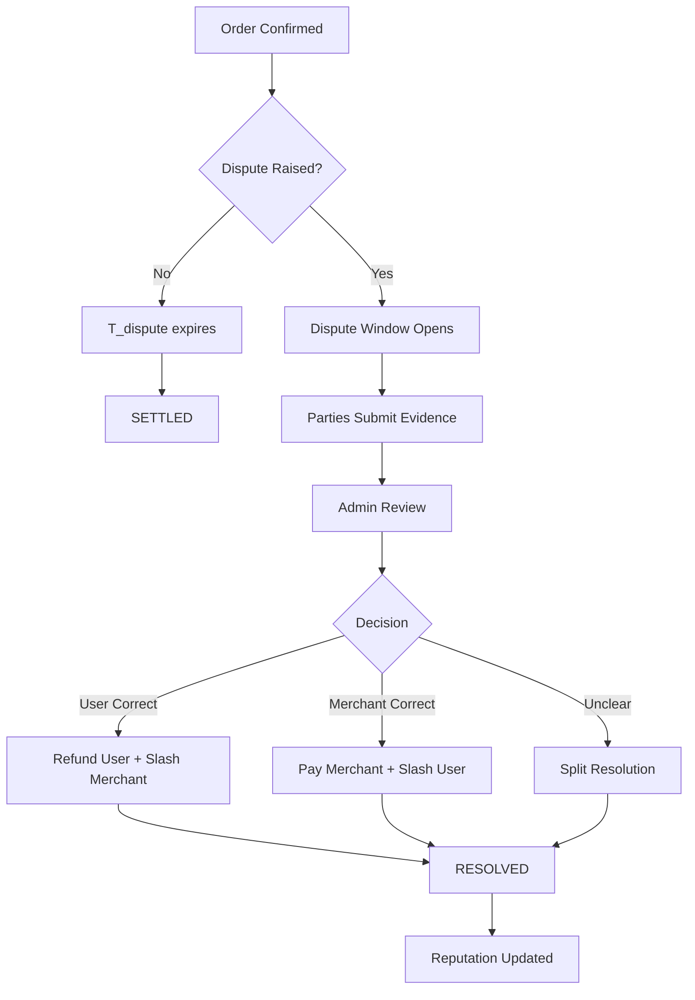

The Protocol is designed to minimize unnecessary data disclosure during disputes. If a user files a dispute, the counterparty can submit evidence of the transaction without exposing additional personal data. In the current contract implementation, disputes are resolved on-chain by authorized admins based on submitted evidence and protocol fault rules. Privacy-preserving bank transaction verification and deeper automated settlement are part of the roadmap (see Section 4.2).

<Info>
**Current Dispute Process:**

1. Party raises dispute within `T_dispute` window
2. Counterparty submits evidence (payment confirmation, screenshots, transaction IDs)
3. Evidence reviewed against protocol rules
4. Authorized admins issue on-chain verdict
5. Settlement executes: USDC released, bonds slashed/returned, reputation updated
</Info>

## Windows & Burdens

<Note>
**Default onus:** The party claiming completion provides evidence of completion. The challenger can present counter-evidence (e.g., bank statement showing non-receipt). Fail-to-prove paths trigger slashing or refunds according to the Protocol rules.
</Note>

### Time Windows

Each order type and payment rail has specific dispute windows:

**Standard Windows:**
- `T_dispute` for low-risk rails: 1 hour after merchant confirmation
- `T_dispute` for medium-risk rails: 6 hours after merchant confirmation
- `T_dispute` for high-risk rails: 24-48 hours after merchant confirmation

**Evidence Submission:**
- Parties have 24-48 hours to submit evidence after dispute is raised
- Extensions may be granted for complex cases requiring off-chain proof generation

### Burden of Proof

**On-Ramp (Fiat → USDC):**
- **Merchant claims:** "I received fiat payment"
- **Merchant must prove:** Bank notification, transaction ID, matching amount and reference
- **User can contest:** Show their bank statement proving no transfer occurred

**Off-Ramp (USDC → Fiat):**
- **Merchant claims:** "I sent fiat payment"
- **Merchant must prove:** Transfer confirmation, recipient details match order
- **User can contest:** Bank statement showing no receipt within time window

## Penalty for False Claims

In the event a buyer attempts to proceed without actually making the fiat transfer first, they risk losing Reputation Points—creating strong economic disincentives for fraudulent behavior.

<Warning>
**Consequences of False Disputes:**

- **Reputation slashing:** Significant RP reduction
- **Bond forfeiture:** Posted bonds are slashed
- **Fee penalties:** Additional penalties for malicious disputes
- **Temporary restrictions:** Reduced limits or temporary suspension
- **Permanent ban:** Repeated false disputes result in protocol ban
</Warning>

### Slashing Schedule

Penalties scale with severity and repetition:

<Accordion title="First False Dispute">
- -50 RP
- 50% bond slashed
- Warning issued
- Transaction limits reduced by 50% for 30 days
</Accordion>

<Accordion title="Second False Dispute">
- -200 RP
- 100% bond slashed
- Transaction limits reduced to minimum for 90 days
- Matching priority set to lowest
</Accordion>

<Accordion title="Third False Dispute">
- Permanent ban from protocol
- All bonds forfeited
- Reputation reduced to zero
- Address blacklisted
</Accordion>

## Privacy-Preserving Evidence

The protocol minimizes data exposure during disputes:

### Current Evidence Types

**Merchant Evidence (On-Ramp):**
- Redacted bank notification showing: amount, date, reference number
- Transaction ID from payment rail
- Timestamp of receipt

**Personal details redacted:** Account numbers, full names, addresses

**User Evidence (On-Ramp Dispute):**
- Bank statement excerpt showing: no matching transaction
- Account balance proof (amount sufficient to make payment)
- Transaction history for relevant time period

**Personal details redacted:** Account numbers, other transactions, full identity

**Merchant Evidence (Off-Ramp):**
- Payment confirmation from sending bank
- Transaction ID and reference
- Recipient details matching order (encrypted to admin only)

**User Evidence (Off-Ramp Dispute):**
- Bank statement showing no receipt
- Account activity log for time window

### Future: ZK-Proof Evidence (Roadmap)

<Note>
Planned evidence module will enable fully cryptographic proofs:

- **ZK-proof of payment:** Prove a transaction occurred without revealing transaction details
- **ZK-proof of non-payment:** Prove no matching transaction exists without exposing full bank history
- **Selective disclosure:** Reveal only the specific fields required for dispute resolution
- **On-chain verification:** Automated verification without human admin review
</Note>

## Dispute Resolution Flow

## Admin Role (Current Implementation)

In the current implementation, disputes are resolved by authorized admins:

### Admin Responsibilities

- Review submitted evidence within 24-48 hours
- Verify evidence authenticity (check transaction IDs with rail providers)
- Apply protocol rules consistently
- Issue on-chain verdict with reasoning
- Execute settlement (release funds, slash bonds, update reputation)

### Admin Constraints

<Warning>
Admins operate under strict constraints:

- **Rule-bound:** Must follow protocol rules, cannot make arbitrary decisions
- **Evidence-based:** Decisions must be based on submitted evidence
- **Transparent:** All verdicts recorded on-chain with reasoning
- **Accountable:** Admin actions auditable by governance
- **Time-limited:** Must resolve within specified windows or default to protocol rules
</Warning>

### Transition to Decentralization

The roadmap includes transitioning to more automated and decentralized dispute resolution:

**Phase 1 (Current):**
- Admin/multisig resolution
- Manual evidence review
- On-chain verdict execution

**Phase 2 (Near-term):**
- ZK-proof evidence submission
- Automated verification for clear cases
- Admin review only for complex disputes

**Phase 3 (Long-term):**
- Fully automated ZK-proof verification
- Decentralized arbitrator pool
- Governance-driven rule updates
- On-chain settlement without admin intervention

## Appeal Process

Users who disagree with a dispute verdict can appeal:

<Steps>
  <Step title="File Appeal">
    Submit appeal within 7 days of verdict, including:
    - Reason for disagreement
    - Additional evidence
    - Appeal fee (returned if appeal successful)
  </Step>
  
  <Step title="Secondary Review">
    Different admin or admin panel reviews case
    Fresh evaluation of all evidence
  </Step>
  
  <Step title="Final Verdict">
    Appeal decision is final
    Reputation and settlement adjusted if verdict changes
    Appeal fee returned or burned based on outcome
  </Step>
</Steps>

<Info>
Frivolous appeals result in additional reputation penalties to prevent appeal spam.
</Info>

## Dispute Statistics and Transparency

The protocol maintains public statistics on dispute resolution:

- **Dispute rate:** Percentage of orders resulting in disputes
- **Resolution time:** Average time to resolve disputes
- **Verdict distribution:** Percentage resolved in favor of each party
- **Appeal rate:** Percentage of verdicts appealed
- **Appeal success rate:** Percentage of appeals that change verdict

These statistics provide transparency and accountability, helping users understand the dispute process and trust in fair resolution.