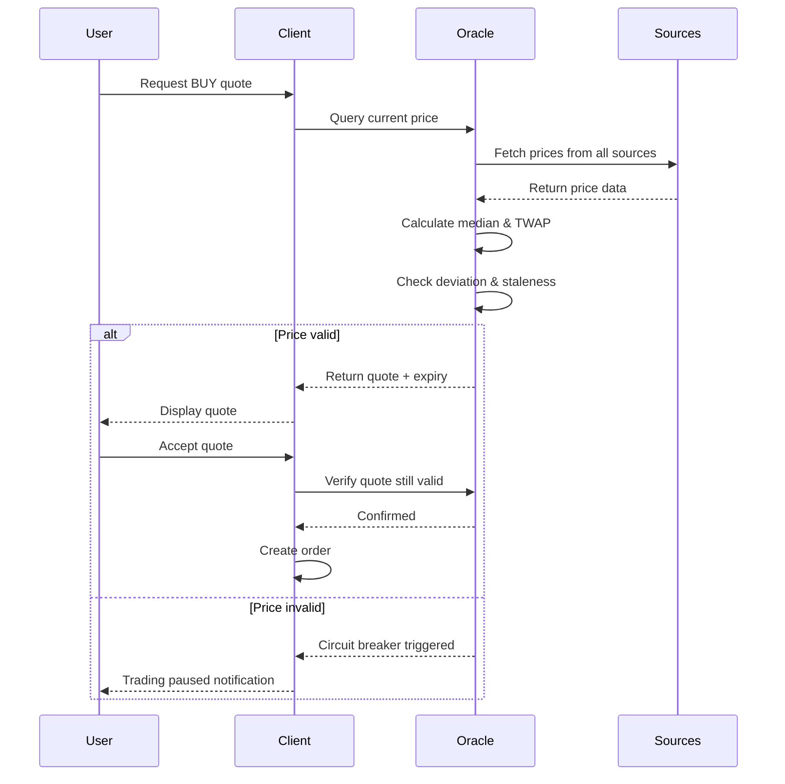

The Protocol determines indicative pricing using built-in oracle adapters that aggregate rates from selected exchanges and P2P venues into a median/TWAP with fallbacks. These oracles analyze price data from a variety of both centralized and P2P exchanges to determine the trading price for the stablecoin-fiat pair in question.

<Info>
**Oracle Parameters:**

- Source set (which exchanges and venues to query)
- Staleness bounds (maximum age of acceptable price data)
- Deviation thresholds (maximum allowed price variance)
- Circuit breakers (when to pause trading)

Quotes carry an expiry to limit exposure; if the oracle fails or exceeds deviation limits, orders pause or re-quote.
</Info>

## Price Aggregation Methodology

The protocol employs a multi-source, multi-method approach to price discovery:

### Data Sources

**Centralized Exchanges:**
- Binance
- Coinbase
- Kraken
- Regional exchanges (based on fiat currency)

**P2P Platforms:**
- Other P2P protocol instances
- OTC desk quotes
- Local exchange averages

**On-Chain Data:**
- DEX prices (Uniswap, Curve)
- Oracle feeds (Chainlink, Pyth)

### Aggregation Methods

<Accordion title="Median Calculation">
The primary method uses the median of all valid sources:

1. Collect prices from all sources
2. Filter out stale or outlier data
3. Calculate median value
4. Apply as reference price

**Advantages:**
- Robust against single-source manipulation
- Resistant to outliers
- Simple and transparent
</Accordion>

<Accordion title="Time-Weighted Average Price (TWAP)">
For added stability, especially during volatile periods:

1. Calculate median at regular intervals (e.g., every 30 seconds)
2. Average these medians over a time window (e.g., 5 minutes)
3. Use TWAP as reference price

**Advantages:**
- Smooths short-term volatility
- Harder to manipulate through brief price spikes
- More stable for users
</Accordion>

<Accordion title="Fallback Hierarchy">
If primary methods fail:

1. **Primary:** Median of all sources
2. **Secondary:** TWAP if real-time median unavailable
3. **Tertiary:** Last known good price (with staleness limits)
4. **Emergency:** Circuit breaker triggers, trading pauses

**Trigger Conditions:**
- Insufficient valid sources (fewer than 3)
- Extreme deviation (greater than 5% from recent average)
- Stale data (>60 seconds old)
- Oracle downtime
</Accordion>

## Price Parameters (Governance-Controlled)

### Staleness Bounds

```json
{
  "max_price_age": 60,           // seconds
  "stale_price_threshold": 120,  // seconds before fallback
  "emergency_price_age": 300     // seconds before circuit breaker
}
```

### Deviation Thresholds

```json
{
  "normal_deviation": 0.02,      // 2% deviation allowed
  "warning_deviation": 0.035,    // 3.5% triggers warnings
  "circuit_breaker": 0.05        // 5% triggers trading pause
}
```

### Quote Expiry

<Note>
All price quotes include an expiry timestamp:
- **Standard expiry:** 60 seconds from quote generation
- **Volatile market expiry:** 30 seconds during high volatility
- **Stable market expiry:** 120 seconds during stable periods

Orders must be matched and accepted before quote expiry, or they receive a fresh quote at current rates.
</Note>

## Circuit Breakers

The protocol includes multiple layers of circuit breakers to protect users during abnormal conditions:

### Level 1: Warning

**Trigger Conditions:**
- Price deviation >3% from TWAP
- Single source failure
- Increased latency in price updates

**Response:**
- Continue trading with enhanced monitoring
- Reduce quote expiry times
- Log events for governance review

### Level 2: Caution

**Trigger Conditions:**
- Price deviation >4.5% from TWAP
- Multiple source failures
- Significant latency issues

**Response:**
- Reduce maximum order sizes by 50%
- Increase bond requirements
- Extend settlement windows
- Alert users to abnormal conditions

### Level 3: Circuit Breaker

**Trigger Conditions:**
- Price deviation >5% from TWAP
- Majority of sources unavailable
- Suspected oracle manipulation
- Flash crash or extreme volatility

**Response:**
- **Immediate trading pause** for all new orders
- Existing orders continue through settlement
- Governance notified automatically
- Manual review required to resume trading

<Warning>
**Emergency Circuit Breaker:**

In extreme circumstances (e.g., oracle hack, market manipulation attempt), authorized admins can trigger an emergency pause:

- All trading halted immediately
- In-flight orders can be safely canceled
- 24-hour review period before trading can resume
- Requires governance approval to lift
</Warning>

## Quote Flow Example



## Regional Price Variations

The protocol accounts for regional price variations:

### Currency-Specific Oracles

Each fiat currency has dedicated oracle sources:

**USD/USDC:**
- US-based exchanges weighted higher
- Includes international USD pairs

**INR/USDC:**
- Indian exchanges (WazirX, CoinDCX)
- P2P local rates
- Official forex rates

**BRL/USDC:**
- Brazilian exchanges (Mercado Bitcoin)
- PIX-based P2P rates
- Regional forex feeds

### Local Spread Adjustments

<Info>
The protocol applies market-adjusted spreads based on:
- Local liquidity conditions
- Payment rail characteristics
- Regional volatility
- Merchant availability

These adjustments ensure fair pricing while maintaining merchant profitability and sustainability.
</Info>

## Oracle Security

### Attack Vectors and Mitigations

<Accordion title="Price Manipulation">
**Attack:** Manipulate a single source to influence the median.

**Mitigation:**
- Use multiple diverse sources (10+)
- Median calculation resistant to outliers
- Outlier detection and filtering
- Source diversity requirements
</Accordion>

<Accordion title="Flash Crash Exploitation">
**Attack:** Execute trades during brief extreme price movements.

**Mitigation:**
- TWAP smoothing over 5-minute windows
- Circuit breakers trigger on rapid changes
- Quote expiry limits exposure window
- Increased bonds during volatility
</Accordion>

<Accordion title="Oracle Downtime">
**Attack:** DDoS oracles to halt trading or force fallbacks.

**Mitigation:**
- Multiple independent oracle providers
- Fallback hierarchy with graceful degradation
- Cached last-known-good prices
- Automatic circuit breaker on extended downtime
</Accordion>

<Accordion title="Front-Running">
**Attack:** Monitor oracle updates and front-run price changes.

**Mitigation:**
- Frequent price updates (every 30s)
- Short quote expiry windows
- Randomized update timing
- On-chain commit-reveal for large orders (planned)
</Accordion>

## Governance and Upgradability

Oracle parameters are governance-controlled:

- **Source management:** Add/remove price sources
- **Weight adjustments:** Change source weights in aggregation
- **Threshold tuning:** Adjust deviation and staleness limits
- **Circuit breaker rules:** Modify trigger conditions
- **Spread parameters:** Update regional spread adjustments

All changes go through standard governance procedures with timelocks and transparency.

<Note>
Emergency parameter updates (e.g., removing a compromised source) can be executed by the multisig with expedited process, subject to later governance ratification.
</Note>