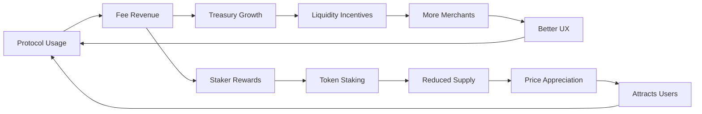

The protocol token is an **ownership token**. The most important parts of the protocol—intellectual property, treasury funds, and the ability to mint new tokens—are controlled by token holders through futarchy-based governance, not by any single team, foundation, or entity. This is real, unruggable ownership of revenue-generating infrastructure.

<Info>
**Token Purpose:**

The protocol token serves three interconnected functions:

1. **Ownership:** Control of protocol IP, treasury, and token supply
2. **Governance:** Decision-making power over parameters, upgrades, and direction
3. **Utility:** Staking, fee discounts, dispute insurance, and protocol participation
</Info>

## Ownership Structure

On the ownership side, decisions that affect token supply must pass through a prediction-market governance mechanism, where participants stake real capital on whether a proposal increases or decreases token value. Proposals the market predicts will harm value are automatically rejected. This replaces subjective voting with market-driven accountability.

### What Token Holders Own

<CardGroup cols={2}>
  <Card title="Protocol IP" icon="copyright">
    All protocol smart contracts, brand assets, and intellectual property are owned by the token holder collective, not by any company or foundation.
  </Card>
  
  <Card title="Treasury" icon="vault">
    Protocol fees and treasury assets are controlled by token governance. No team or entity can unilaterally access funds.
  </Card>
  
  <Card title="Token Minting" icon="coins">
    New token issuance requires governance approval through prediction markets. No backdoor minting possible.
  </Card>
  
  <Card title="Protocol Direction" icon="compass">
    Roadmap, features, partnerships, and strategic decisions are governed by token holders.
  </Card>
</CardGroup>

### Unruggable Design

<Warning>
**Why It's Unruggable:**

- **No admin keys:** After decentralization, no team controls contracts
- **No token mint authority:** Only governance can mint
- **No treasury access:** Treasury requires governance approval
- **No IP transfer:** Protocol IP owned by token holder collective
- **Transparent execution:** All governance actions on-chain and auditable

If protocol resources were ever misappropriated, token governance provides the mechanism for holders to redirect control.
</Warning>

## Governance Mechanism

On the governance side, holders vote on fee structures, transaction limits, risk weights, oracle configurations, treasury allocation, and protocol upgrades. Revenue direction, parameter changes, and IP stewardship belong to the token holder base rather than a centralized team.

### Standard Governance

For most decisions:

1. **Proposal:** Community member submits proposal
2. **Discussion:** 7-day discussion period
3. **Voting:** Token holders vote (quorum and approval thresholds vary by proposal type)
4. **Execution:** Approved proposals execute after timelock

See [Governance section](#) for complete details.

### Futarchy for Token Supply

<Note>
**Prediction Market Governance:**

For decisions affecting token supply (minting, buybacks, burns):

1. **Proposal:** Suggest token supply change
2. **Market Creation:** Two prediction markets created:
   - Market A: "Token price if proposal passes"
   - Market B: "Token price if proposal fails"
3. **Trading Period:** Participants trade on markets for 7 days
4. **Decision:** If Market A price > Market B price, proposal passes
5. **Settlement:** Markets settle based on actual outcome

**Rationale:**
- Participants have skin in the game
- Market prices aggregate information efficiently
- Prevents harmful supply changes
- Aligns incentives with token value
</Note>

### Example: Futarchy in Action

<Accordion title="Proposal: Mint 1M Tokens for Liquidity Incentives">
**Scenario:**
Team proposes minting 1 million new tokens to incentivize liquidity providers.

**Prediction Markets:**
- **Market A (passes):** Predicts token price if 1M tokens minted
- **Market B (fails):** Predicts token price if proposal rejected

**Trading Activity:**
- Traders who believe incentives will grow protocol → Buy Market A
- Traders who believe dilution is harmful → Buy Market B
- Market prices converge on consensus probability

**Outcome:**
- After 7 days: Market A = $1.15, Market B = $1.08
- Market predicts proposal increases value → Proposal passes
- 1M tokens minted for liquidity program
- Markets settle based on actual token price 30 days later
</Accordion>

<Accordion title="Proposal: Emergency Token Burn">
**Scenario:**
Community proposes burning 500k tokens from treasury to reduce supply.

**Prediction Markets:**
- **Market A (passes):** Predicts token price if burn happens
- **Market B (fails):** Predicts token price if burn rejected

**Trading Activity:**
- Some traders believe supply reduction will pump price → Buy Market A
- Others believe treasury funds more valuable intact → Buy Market B

**Outcome:**
- After 7 days: Market A = $0.95, Market B = $1.02
- Market predicts proposal decreases value → Proposal rejected
- Treasury remains intact for productive use
- Markets settle, Market B traders profit
</Accordion>

## Economic Utility

On the economic side, merchants and verifiers stake tokens as bonds, aligning their incentives with honest behavior. Fee routing provides rebates and discounts to active participants. The token enables participation in dispute insurance pools and community delegation for revenue sharing.

### Staking Mechanisms

<Accordion title="Merchant Staking">
**Purpose:** Align merchant incentives with protocol health

**Mechanism:**
- Merchants stake tokens as bonds (in addition to USDC bonds)
- Staked tokens earn portion of transaction fees
- Slashed for fraudulent behavior
- Unstaking has 7-day cooldown

**Benefits:**
- Additional yield for honest merchants
- Stronger fraud deterrent
- Long-term alignment with protocol success

**Example:**
```
Merchant stakes: 10,000 tokens
Monthly volume: $1,000,000
Monthly fees earned: $5,000
Token reward: 100 tokens (based on stake size and volume)
APY: ~12% (if token stable)
```
</Accordion>

<Accordion title="Liquidity Provider Staking (Planned)">
**Purpose:** Incentivize deep liquidity

**Mechanism:**
- LPs stake tokens + USDC in liquidity pools
- Earn transaction fees + token emissions
- Higher rewards for underserved regions
- Lock periods: 0, 30, 90, 180 days (increasing rewards)

**Benefits:**
- Deeper liquidity for users
- Lower spreads
- Faster settlement
- Predictable capacity

**Projected APY:**
- No lock: 8-12%
- 30-day lock: 12-18%
- 90-day lock: 18-25%
- 180-day lock: 25-40%

*APY varies by region, liquidity depth, and market conditions*
</Accordion>

<Accordion title="Verifier Staking (Planned)">
**Purpose:** Ensure honest identity verification

**Mechanism:**
- Verifiers stake tokens to operate
- Earn fees per verification
- Slashed if verification proven fraudulent
- Reputation system for verifiers

**Benefits:**
- Decentralized verification
- Economic alignment
- Reduced reliance on any single verifier

**Economics:**
- Minimum stake: 50,000 tokens
- Fee per verification: $0.50 - $2.00
- Slashing: 10% of stake for minor issues, 100% for fraud
</Accordion>

### Fee Discounts

Token holders receive fee discounts:

**Tier Structure:**
```
Holding 0-100 tokens: 0% discount (standard 0.5% fee)
Holding 100-1,000 tokens: 10% discount (0.45% fee)
Holding 1,000-10,000 tokens: 20% discount (0.4% fee)
Holding 10,000+ tokens: 30% discount (0.35% fee)
```

**Discount Application:**
- Snapshot taken at order creation
- Discount applied automatically
- Holdings must be in same wallet
- Staked tokens count toward discount

<Info>
For a user trading $10,000/month:
- Standard fee: $50/month
- With 10,000 tokens: $35/month
- Savings: $15/month = $180/year

Token discount pays for itself if token price stable or appreciating.
</Info>

### Dispute Insurance Pool (Planned)

Token holders can participate in dispute insurance:

**Mechanism:**
1. Stake tokens in insurance pool
2. Pool covers user losses from merchant defaults
3. Earn fees from insurance premiums
4. Risk of payout if claims exceed premiums

**Economics:**
- Premium: 0.1% of order value (optional for users)
- Coverage: Up to 100% of order value
- Pool stakers earn premiums proportional to stake
- Slashed proportionally if payouts required

**Benefits:**
- Users: Protection against merchant default
- Stakers: Yield from premiums
- Protocol: Increased user confidence

### Revenue Sharing (Planned)

Portion of protocol fees distributed to token stakers:

**Distribution:**
- 10% of protocol fees → Revenue sharing pool
- Distributed proportionally to staked tokens
- Paid in USDC (stablecoin, not volatile token)
- Claimed anytime or auto-compounded

**Example:**
```
Protocol monthly fees: $1,000,000
Revenue sharing allocation: $100,000
Your stake: 10,000 tokens
Total staked: 10,000,000 tokens
Your share: $100 (0.1% of pool)
Annualized: $1,200 on 10,000 token stake
```

## Token Supply

### Initial Supply

<Note>
**Total Supply at TGE: 1,000,000,000 tokens**

Distribution:
- **Community & Ecosystem:** 40% (400M tokens)
- **Core Team:** 20% (200M tokens)
- **Investors:** 15% (150M tokens)
- **Treasury:** 15% (150M tokens)
- **Liquidity:** 10% (100M tokens)

Total: 1,000,000,000 tokens (1 billion)
</Note>

### Allocation Details

<Accordion title="Community & Ecosystem (40%)">
**400,000,000 tokens allocated to:**

- **Liquidity mining:** 150M tokens (4-year emission)
- **User rewards:** 100M tokens (reputation rewards, referrals)
- **Developer grants:** 50M tokens (ecosystem development)
- **Community treasury:** 50M tokens (governance-directed)
- **Airdrops:** 30M tokens (early users, testnet participants)
- **Partnerships:** 20M tokens (strategic integrations)

**Vesting:**
- Liquidity mining: Linear over 4 years
- User rewards: Earned through protocol participation
- Grants: Per-project vesting (typically 1-2 years)
- Airdrops: 25% immediate, 75% over 6 months
</Accordion>

<Accordion title="Core Team (20%)">
**200,000,000 tokens for:**

- Protocol developers
- Operations team
- Early contributors

**Vesting:**
- 1-year cliff
- 4-year linear vesting after cliff
- No tokens liquid at TGE

**Alignment:**
- Long-term vesting aligns team with protocol success
- Cannot dump on community
- Significant skin in the game
</Accordion>

<Accordion title="Investors (15%)">
**150,000,000 tokens for:**

- Seed round investors
- Strategic investors
- Advisory board

**Vesting:**
- 6-month cliff
- 3-year linear vesting after cliff
- No tokens liquid at TGE

**Terms:**
- All investors subject to same vesting
- No special deals or accelerated vesting
- Market standard terms
</Accordion>

<Accordion title="Treasury (15%)">
**150,000,000 tokens for:**

- Protocol development funding
- Security audits and bug bounties
- Legal and compliance
- Marketing and growth
- Emergency reserves

**Control:**
- Fully governed by token holders
- No team access
- Transparent on-chain
- Quarterly reporting
</Accordion>

<Accordion title="Liquidity (10%)">
**100,000,000 tokens for:**

- DEX liquidity pairs
- Market making
- CEX listings (if applicable)

**Usage:**
- Paired with USDC/ETH for initial liquidity
- Some tokens retained for future liquidity needs
- Managed by treasury/governance
</Accordion>

### Emission Schedule

New tokens emitted for liquidity mining:

**Year 1:** 75M tokens (50% of liquidity mining allocation)
**Year 2:** 45M tokens (30%)
**Year 3:** 22.5M tokens (15%)
**Year 4:** 7.5M tokens (5%)

**Total:** 150M tokens over 4 years

<Info>
**Declining Emissions:**

Emissions decline over time as:
- Protocol matures
- Fee revenue increases
- Less subsidy needed
- Token value (hopefully) appreciates

Goal: Transition from token incentives to fee-driven sustainability.
</Info>

### Supply Cap and Inflation

<Warning>
**Supply Policy:**

- **No hard cap:** Protocol can mint if governance approves via futarchy
- **Default: No inflation:** No automatic emissions after initial 4-year schedule
- **Future minting:** Only through prediction market governance
- **Potential burns:** Governance can vote to burn tokens

**Rationale:**
- Flexibility for long-term protocol needs
- Market-driven supply decisions via futarchy
- No arbitrary cap that may not be optimal
- Token holders maintain control
</Warning>

## Value Accrual

How does the token capture value?

### Revenue Generation

**Protocol Revenue Sources:**
1. Transaction fees (0.5% of order value)
2. Merchant bond yields
3. Verification fees (planned)
4. Premium features (planned)
5. Partnership revenue

**Revenue Allocation:**
- 40% → Treasury (governance-controlled)
- 5% → Protocol development
- 10% → Token staker revenue sharing
- 45% → Merchants (incentive for liquidity)

<CardGroup cols={2}>
  <Card title="Fee Revenue" icon="money-bill-wave">
    As protocol volume grows, fee revenue increases. Portion flows to token stakers and treasury, creating fundamental value.
  </Card>
  
  <Card title="Treasury Growth" icon="piggy-bank">
    Treasury accumulates USDC from fees. Governance can use for buybacks, burns, or productive investments.
  </Card>
  
  <Card title="Staking Yield" icon="percent">
    Merchants and LPs earn yield by staking tokens, creating demand and reducing circulating supply.
  </Card>
  
  <Card title="Fee Discounts" icon="tag">
    Active traders benefit from holding tokens for fee discounts, creating organic demand.
  </Card>
</CardGroup>

### Growth Flywheel



<Info>
**Positive Feedback Loop:**

1. More users → More fees
2. More fees → Better staking yields
3. Better yields → More staking
4. More staking → Reduced circulating supply
5. Reduced supply + demand → Price appreciation
6. Price appreciation → Attracts more users
7. More users → More fees (loop continues)

Additionally:
- Growing treasury enables more ecosystem development
- Development attracts more builders and users
- Network effects compound
</Info>

## Token Launch (TGE)

### Launch Plan

**Planned Date:** March 2026

**Launch Venues:**
1. DEX launch (Uniswap V3 on Base)
2. Centralized exchange listings (TBD)
3. Cross-chain bridges (after Solana deployment)

**Initial Liquidity:**
- $5M USDC + 100M tokens
- Liquidity locked for 6 months minimum
- Additional liquidity from market makers

**Price Discovery:**
- Free market determines initial price
- No fixed price or sale
- Launch at market open on DEX

### Fair Launch Principles

<Note>
**Commitment to Fairness:**

- **No presale to public:** Only strategic investors with vesting
- **No team tokens liquid at launch:** 1-year cliff for team
- **No insider advantage:** Everyone launches at same time
- **Transparent allocation:** All distributions public and verifiable
- **Locked liquidity:** Cannot be rugged
- **Gradual unlock:** Vesting prevents dumps
</Note>

### Post-Launch Roadmap

**Month 1-3:**
- Liquidity mining begins
- Airdrop distributions
- Governance transition from multisig to token holders
- Additional CEX listings

**Month 3-6:**
- Full governance live
- Staking features activated
- Revenue sharing begins
- First governance votes

**Month 6-12:**
- Futarchy implementation for supply decisions
- Specialized governance councils
- Cross-chain token bridges
- Mature token economy

## Long-Term Sustainability

The token economy is designed for long-term sustainability:

### Transition from Subsidies to Fees

**Phase 1 (Year 0-2): Subsidy-Driven**
- High token emissions for liquidity mining
- Merchant incentives primarily from tokens
- User growth prioritized over immediate revenue

**Phase 2 (Year 2-4): Hybrid**
- Declining token emissions
- Growing fee revenue
- Mix of token incentives and fee-based rewards

**Phase 3 (Year 4+): Fee-Driven**
- Minimal or no token emissions
- Fee revenue sustains protocol operations
- Token remains governance and utility asset
- Sustainable without continuous dilution

### Success Metrics

The token economy succeeds if:

<CardGroup cols={2}>
  <Card title="Protocol Revenue Growth" icon="chart-line">
    Fee revenue grows faster than token inflation, creating net value accrual.
  </Card>
  
  <Card title="Treasury Sustainability" icon="circle-check">
    Treasury can fund operations and development without token sales.
  </Card>
  
  <Card title="Governance Participation" icon="users-between-lines">
    Active, informed governance with high voter turnout and quality discussions.
  </Card>
  
  <Card title="Utility Adoption" icon="puzzle-piece">
    Token actively used for staking, discounts, and protocol participation.
  </Card>
</CardGroup>

<Warning>
**No Guarantees:**

Token value is NOT guaranteed. Success depends on:
- Protocol adoption and growth
- Market conditions
- Governance quality
- Competitive landscape
- Execution by community and developers

Invest only what you can afford to lose. Do your own research.
</Warning>